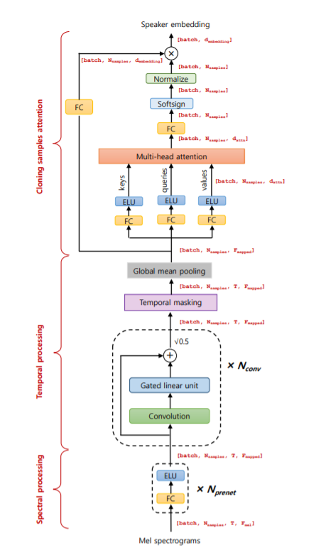

# Neural_Voice_Cloning
### ABSTRACT
Voice cloning is a highly desired feature for personalized speech interfaces. We
introduce a neural voice cloning system that learns to synthesize a person’s voice
from only a few audio samples. We study two approaches: speaker adaptation
and speaker encoding. Speaker adaptation is based on fine-tuning a multi-speaker
generative model. Speaker encoding is based on training a separate model to
directly infer a new speaker embedding, which will be applied to a multi-speaker
generative model. In terms of naturalness of the speech and similarity to the original
speaker, both approaches can achieve good performance, even with a few cloning
audios. An opensource implementation of Baidu Research Paper **[Link](https://arxiv.org/pdf/1802.06006.pdf)**

## Steps

    

